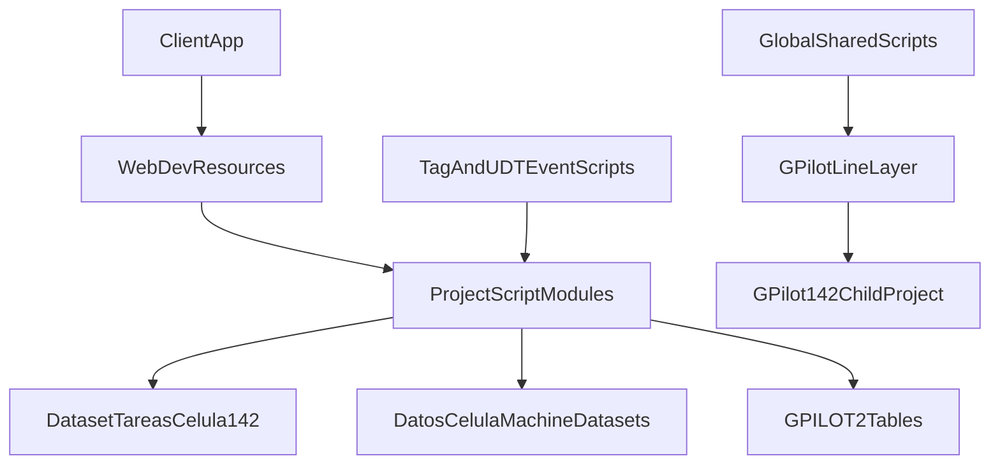

# g-pilot Architecture Context

## Purpose

Persistent architecture context for the `g-pilot` Ignition project so future sessions can start from shared understanding without re-discovery.

Project hierarchy in scope:

- `global -> g-pilot -> g-pilot-142`

Confirmed by user:

- `global` owns shared scripts/business logic.
- `g-pilot-142` is a separate Ignition child project.

---

## Repository Role

This repository is an Ignition project export focused on backend/service behavior:

- Web Dev HTTP resources
- Project script-library modules
- Tag and UDT definitions with event scripts
- Supporting docs around runtime behavior

React frontend source is not present in this repository.

---

## Core Identity and Runtime Anchors

Primary constants in `constantes.py`:

- `LINEA = "G_PILOT"`
- `DATABASE = "GPILOT2"`
- `tag_provider = "[G-PILOT_TAGS]"`
- `celulaLinea = "142"`
- `celulas = ["142A", "142B", "142C", "142D"]`

This establishes `g-pilot` as a line-scoped project (line 142 family) with table naming and tag paths derived from `G_PILOT`.

---

## Architecture Layers

## 1) Web Entry Layer

Path:

- `com.inductiveautomation.webdev/resources`

Pattern:

- Route folders contain `doGet.py` / `doPost.py` handlers and `config.json`.
- Many resources are gateway-scoped (`scope: "G"` in `resource.json`).

Representative endpoints:

- `Inicio/GestionUsuario/doPost.py` (user bootstrap/login data)
- `Tareas/Data/doGet.py` (planner dataset read)
- `Tareas/CompletarTareas/doPost.py` (manual completion)
- `Administracion/GestionTareas/crearTareas/doPost.py` (admin task creation)

## 2) Business Script Layer

Main script roots:

- `Tareas`
- `Sinoptico`
- `Inicio`
- `Administracion`

Key modules:

- `Tareas/Secuencia/General/code.py` (top-level orchestration)
- `Tareas/Data/General/code.py` (task lifecycle and scheduling)
- `Tareas/Data/Teorico/code.py` (theoretical planning)
- `Tareas/Data/TagsMaquina/code.py` (machine helper datasets/counters)
- `Tareas/Data/Desviacion/code.py` (machine deviation)
- `Tareas/Data/DesviacionTareas/code.py` (task-specific automation)
- `Tareas/Data/fromExcelToDB/code.py` (Excel -> DB pipeline)
- `Sinoptico/Data/General/code.py` (machine/topology/telemetry helpers)
- `Inicio/Data/GestionUsuarios/code.py` (user and role bootstrap)
- `Administracion/Data/GestionTareas/code.py` / `GestionUsuarios/code.py` (admin operations)

Most project library resources are all-scope (`scope: "A"`).

## 3) State and Integration Layer

Primary state surfaces:

- Global planner dataset tag: `Dataset/Tareas_Celula{celulaLinea}`
- Machine helper datasets under: `Datos_Celula/Celula{X}/Maq_{N}/...`
- SQL DB (`GPILOT2`) tables in `G_PILOT_*` families

Representative DB families (from docs and code usage):

- `G_Pilot_Secuencia`
- `G_Pilot_Tareas`
- `G_Pilot_Tareas_Resumen`
- `G_Pilot_Completados`

External/system integrations used by scripts:

- OEE/production tables
- QDAS verification data
- GearFlow SOAP integration

## 4) Tag/UDT Event Layer

Files:

- `tags.json`
- `udts.json`

These include valueChanged scripts that can trigger runtime behavior (not only passive data).  
Observed example: script import pattern `from G_PILOT import iniciarEstandar`.

---

## High-Level Data Flow

---

## Representative Runtime Flows

## A) User bootstrap flow

1. `Inicio/GestionUsuario/doPost.py` receives `numUsuario`.
2. Calls `Inicio.Data.GestionUsuarios.obtenerDatos`.
3. Reads user + role from DB.
4. Writes `Variables/Inicio/idUsuario`.
5. Returns `[nombre, usuario, mail, rol, idUsuario]`.

## B) Planner read flow

1. `Tareas/Data/doGet.py` reads tag path `Dataset/Tareas_Celula142`.
2. Converts dataset to array rows.
3. Returns rows as JSON for client view.

## C) Manual task completion flow

1. `Tareas/CompletarTareas/doPost.py` receives `celula`, `maquina`, `tarea`.
2. Resolves `referencia` + machine number via `Sinoptico.Data.General`.
3. Calls `Tareas.Secuencia.General.completarTarea(...)`.
4. Completion flow updates helper counters, reprograms pending times, updates planner dataset, logs completion in DB.

## D) Standard initialization flow

1. `Tareas.Secuencia.General.cargarEstandar` loads Excel pages into `_Secuencia`.
2. Builds `_Tareas` and refreshes `_Tareas_Resumen`.
3. `iniciarEstandar(celula)` regenerates schedule rows for that cell.
4. Merges into global planner dataset while preserving other cells.
5. Syncs per-machine helper datasets and derived tasks.

---

## Ownership Boundary Assumptions

Current working assumptions for design decisions:

- `global`: shared, reusable script logic and common behavior contracts.
- `g-pilot` (this repo): line-specific implementation for `G_PILOT`, including Web Dev resources, table conventions, and tag contracts.
- `g-pilot-142`: separate child project for 142-specific deployment/runtime specialization.

Potential coupling points to treat carefully:

- Hardcoded line/table naming in `constantes.py`
- Import/name conventions using `G_PILOT`
- Shared dataset/tag schemas expected across modules and event scripts

---

## Current Risk Hotspots

1. **Web security exposure**
   - Multiple Web Dev configs show `require-auth: false`, `require-https: false`, broad CORS.

2. **Dataset race conditions**
   - Several flows perform read-modify-write on shared planner/helper datasets.

3. **Split source of truth**
   - Runtime truth can diverge between DB rows, planner dataset, and helper machine counters.

4. **Implicit inheritance coupling**
   - Parent/child boundaries appear convention-based; cross-project impact may be non-obvious.

5. **Mixed legacy/current paths**
   - Presence of `_v0` functions and parallel implementations increases maintenance risk.

---

## Fast Re-Entry Checklist (for future sessions)

If starting from scratch in a new chat, review in this order:

1. `constantes.py`
2. `Tareas/Secuencia/General/code.py`
3. `Tareas/Data/General/code.py`
4. `Tareas/Data/Teorico/code.py`
5. `Tareas/Data/TagsMaquina/code.py`
6. `Tareas/Data/DesviacionTareas/code.py`
7. `com.inductiveautomation.webdev/resources/**` relevant endpoint handlers
8. `tags.json` and `udts.json` event scripts
9. This file (`docs/GPILOT_ARCHITECTURE_CONTEXT.md`)

---

## Suggested Next Deep Dives

- API contract and security hardening pass (auth/https/roles/CORS).
- Explicit parent-child contract matrix (`global` vs `g-pilot` vs `g-pilot-142`).
- Concurrency and idempotency review for planner/helper dataset updates.
